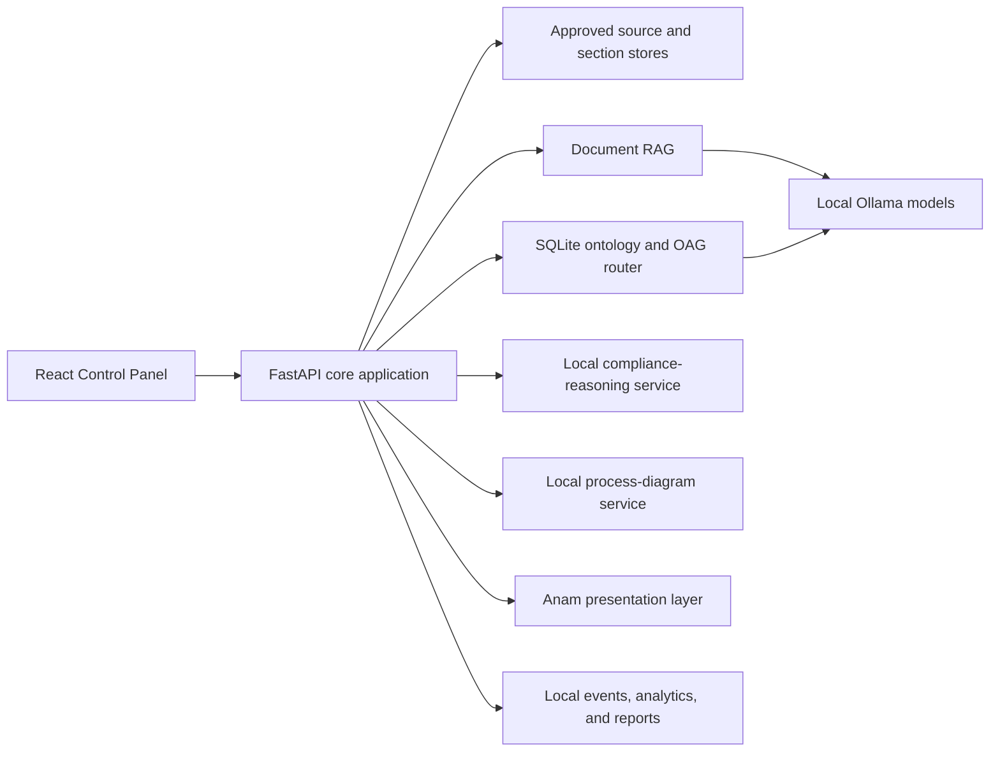

# Architecture status

OpsAtlas is delivered as a local-first proof of concept: a React Control Panel, a Python/FastAPI core application, local Ollama models, a SQLite ontology, controlled local runtime stores, and bounded supporting services. Anam is the only managed runtime component and is used solely to render the optional Digital SME experience.

## Final implementation map

| Module | Final status | Responsibility and evidence |
|---|---|---|
| Source and data governance | Implemented | Registration, upload, metadata, approval, rejection, and source state in `src/assistant/sources/` |
| Ingestion and preparation | Implemented | Text extraction, section construction, and approved evidence storage in `src/assistant/ingestion/` |
| Document retrieval / RAG | Implemented | Lexical and embedding retrieval, rewrite, thresholding, reranking, and evidence composition in `src/assistant/retrieval/` and `src/assistant/answer/` |
| Ontology store and OAG routing | Implemented | Governed SQLite objects/links, synchronisation, query, reconciliation, and structured routing in `src/assistant/ontology/` |
| Model-provider abstraction | Implemented | Environment-configured generation and embedding provider in `src/assistant/models/provider.py` |
| Guardrails, grounding, and refusal | Implemented | Input checks, evidence-bounded prompting, citation support validation, confidence, and refusal in `src/assistant/guardrails/` and `src/assistant/answer/` |
| Governance intelligence | Implemented | Quick Scan, issue grouping, accepted decisions, remediation, and review jobs in `src/assistant/governance/` |
| Compliance-reasoning service | Implemented | Cached, resumable internal/external pair review with bounded screening and adjudication in `services/compliance_reasoning/` |
| Process Registry | Implemented | Structured process records, roles, systems, controls, dependencies, and coverage in `src/assistant/process/` |
| Process-diagram service | Implemented | Independent deterministic JSON, layout, animation, narration, and SVG rendering in `services/process_diagram/` |
| Enterprise Activity Model | Implemented | Activity, Accountability, Risk Heat, Relationship, and Digital System projections in `src/assistant/eam/` |
| Analytics and improvement actions | Implemented | Demand, quality, grounding, retrieval, recurrence, governance, OAG operations, process complexity, forecast, value, reports, and governed actions in `src/assistant/analytics/` and `src/assistant/value/` |
| Digital SME / Anam rendering | Implemented within PoC boundary | Uses the core answer route and presents its validated answer through managed Anam rendering in `src/assistant/api/routes_avatar.py` and `frontend/src/AvatarLabPage.tsx` |
| Simulator and Process Stress Lab | Implemented as bounded diagnostics | Synthetic scenario journeys and deterministic pressure analysis in `src/assistant/simulator/` and `src/assistant/process/stress.py` |
| Build, test, and CI | Implemented | Pytest, Ruff, frontend production build, and pipeline checks in `tests/`, `pyproject.toml`, and `azure-pipelines.yml` |
| Azure DevOps delivery automation | Implemented | Reusable backlog/wiki automation in `automation/azure_devops/` and protected GitHub mirroring in the pipeline |

## Runtime boundaries

- The core application is authoritative for source approval and knowledge state.
- Document RAG remains necessary for narrative and contextual questions.
- Ontology evidence is preferred for structured and relational questions.
- Mixed questions can combine ontology facts with document passages.
- `oag_only` exists as a benchmark boundary test, not as a general user mode.
- Compliance reasoning can propose findings but cannot approve or edit organisational knowledge.
- The diagram service renders validated process representations but cannot alter process records.
- The ontology agent can investigate and propose bounded actions; schema validation and human approval govern mutations.
- Anam presents the answer returned by OpsAtlas and does not supply an independent organisational answer.

## Quality baseline

The accepted final RAG/OAG evaluation used 69 labelled questions, three configurations, three repeated runs, and 621 total executions. Its untouched 24-question holdout produced:

| Configuration | Passed | Accuracy | Route accuracy | Stable questions | Mean latency |
|---|---:|---:|---:|---:|---:|
| RAG-only | 53/72 | 73.61% | 50.00% | 22/24 | 3.84s |
| OAG-first | 68/72 | 94.44% | 100.00% | 23/24 | 1.32s |
| OAG-only | 48/72 | 66.67% | 83.33% | 24/24 | 0.03s |

OAG-first is therefore the preferred hybrid route in this proof of concept. It achieved full holdout accuracy for structured entities, structured relationships, aggregates, and out-of-scope refusal; narrative accuracy was 91.7% and mixed accuracy was 75%. The result supports the route for this labelled local workload and should not be generalised into a universal production claim.

See [the final benchmark decision](docs/benchmark/oag/README.md) and [raw accepted result](docs/benchmark/oag/rag-vs-oag-final-benchmark.json).

## Production considerations

The implemented PoC is intentionally bounded. Enterprise deployment would require production identity and access management, durable managed storage, concurrency and resilience testing, operational monitoring, live-system integration controls, corpus-specific ontology assurance, and validation against non-synthetic operational data. Managed Digital SME rendering also introduces an external availability and data-handling dependency when enabled.
