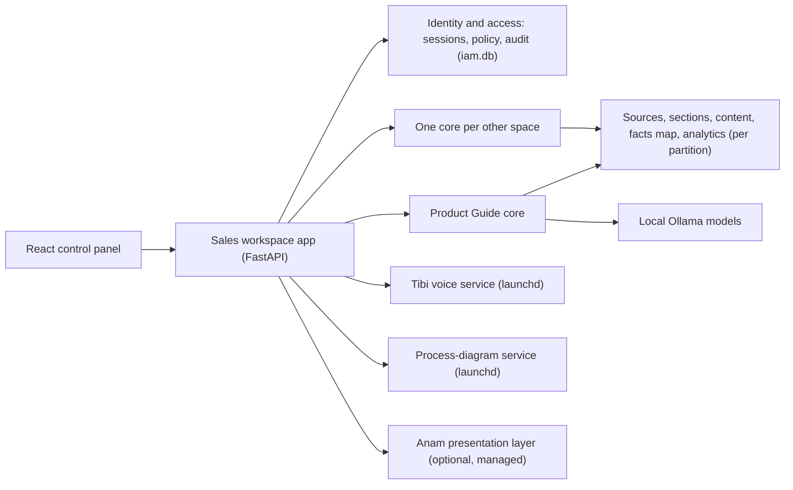

# Architecture status

**As of 2 October 2026** (OpsAtlas Sales: the live branch is `claude/tiberius-speed-safety`, open as PR 2 into `main`;
the reference-architecture benchmark's phase 0 is on `claude/ref-phase-0`, REF E1). OpsAtlas Classic, the version submitted for DT603, is preserved unchanged in its own checkout and tag
(see [docs/opsatlas-classic-and-sales.md](docs/opsatlas-classic-and-sales.md)); this file describes OpsAtlas Sales.

OpsAtlas is a local-first product: a React control panel, a Python/FastAPI core per knowledge space, local Ollama
models, a SQLite facts map (ontology) per space, file-backed stores under one workspace, and bounded local
services (Tibi, the voice companion, and the process-diagram service) run by launchd. Managed components: Anam
renders the optional Digital SME; statement governance can use a hosted model when configured (the local judge is
the default). Nothing else leaves the machine.

## Release facts

Generated from the engine registry, the Sales profile, the route manifest and the permission catalogue; a test fails
when this block is stale (REF S7).

<!-- release facts: generated by scripts/release_facts.py; do not edit by hand -->
| Fact | Value |
|---|---|
| Tibi engine | 1.8.6 (2026-10-02), fingerprint `d490073ee0b3`; models: conversation `qwen2.5:7b-instruct`, process_notes `qwen3.5:35b-a3b`, review `qwen3.5:4b` |
| Its latency replay | 100 turns: p50 1,481 ms, p95 1,942 ms (budget p50 1,950 ms, p95 3,100 ms); `evaluation/results/tibi/2026-10-02-latency-replay-engine-1.8.6.json` |
| Sales answers | model `qwen3.5:4b`, embeddings `nomic-embed-text`; query rewriting off, reranking off, model thinking off (`services/opsatlas_sales/profile.json`) |
| Workspace routes | 234 classified: 208 human, 16 service, 10 public (`assistant.api.access.manifest`) |
| Permission catalogue | version 3: 163 permissions, 54 reserved (guard nothing yet); role seeds version 2, 12 built-in roles |
<!-- /release facts -->

## Implementation map

| Area | Status | Where, and what changed recently |
|---|---|---|
| Knowledge spaces | Implemented, phase 2 | `services/opsatlas_sales/spaces.py`: the OpsAtlas family (Product Guide, Sales Playbook, System settings) and organisation spaces, each on its own partition and core; organisations start empty; transfer between spaces arrives unapproved (KS E1). A leak suite plants names in two organisations and checks 243 requests, the answers and the disk: nothing crosses (AUDIT F16). The workspace app's routes are in four router modules (AUDIT F13) |
| Identity and access | Implemented, first release | `src/assistant/iam/`, `src/assistant/api/access.py`: personal accounts, cookie sessions with CSRF, a permission catalogue (163 keys, version 2), built-in roles, a policy evaluator, a hash-chained audit, bootstrap and recovery procedures; every route classified; the Identity & Access section of the panel. Single-factor; see [docs/iam/README.md](docs/iam/README.md) (IAM E1) |
| Sources, ingestion, content management | Implemented | `src/assistant/sources/`, `ingestion/`, `content/`: governed editing with drafts, versions, comments and suggestions (CM E1); JSON stores written atomically (ARCH F1); the request's principal is the author (IAM F5) |
| Retrieval, answers, guardrails | Implemented | `src/assistant/retrieval/`, `answer/`, `guardrails/`: lexical and embedding retrieval over an in-memory index built once per corpus change, with a pruned embeddings cache (ARCH F7: 925 ms → 6 ms a search at 5,000 sections); query rewriting and reranking are built and switched off in the Sales profile (see Release facts); fallbacks are logged and recorded with the answer (ARCH F5); the off-topic guard no longer blocks "forecast" (ARCH F6); the model call sends `think: false` and a bounded output (ARCH H3a: a guide answer in 2.1 s instead of 57 s); a space's referral and topic notes add fixed sentences after generation: the sales pointer on commercial and integration topics (ARCH H2b) and the retired compliance service's note (ARCH H4c) |
| Facts map (ontology) and OAG routing | Implemented | `src/assistant/ontology/`: rebuilt in one transaction, and after a source is deleted or transferred (ARCH F2); aliases in one total order, so prompts no longer change with the hash seed (AUDIT F10) |
| Governance intelligence | Implemented | `src/assistant/governance/`: quick scan, internal review (one review at a time, queued, ARCH F5), accepted decisions, remediation; statement governance on the sales data (GOV E1) |
| Tibi, the voice companion | Live; the engine version is in Release facts | `services/sme_interviewer/`: local speech, conversation, sales rehearsal, the Digital SME's text channel, process interviews with one process-map notation (TIBI E2–E5); engine versions and the latency budget in `config/tibi/`, evaluation sets and results in `evaluation/` (AUDIT F14). The Digital SME speaks Tibi's engine reply (TIBI E4; DEC-012 amended 2 October 2026) |
| Process registry and maps | Implemented | `src/assistant/process/`, `services/process_diagram/`: one notation for every map (paths side by side, XOR/AND/ANY, events, interfaces, several roles); interviews captured by Tibi |
| Enterprise Activity Model | Implemented | `src/assistant/eam/` (EAM #1178) |
| Analytics and improvement actions | Implemented | `src/assistant/analytics/`: demand, quality, grounding, retrieval, recurrence, governance, forecast, reports; persona traffic excluded from the usage analytics by default (ARCH F4). Value analytics is parked in OpsAtlas Classic (AUDIT F1) |
| Compliance-reasoning service | Removed from Sales (AUDIT F1) | Superseded by statement governance (GOV E1). OpsAtlas Classic keeps the service; the facts map still reads a data copy's last review (`src/assistant/compliance/latest.py`) |
| Control panel | Implemented | `frontend/`: every page but the dashboard loads when opened (main bundle 232 kB); a page's error stays on that page; addresses route even without an item's id; analytics tabs are in the address; a refused permission reads as the server's reason (AUDIT F4, F9). The API client is split by area under `frontend/src/api/`; shared page pieces (`useLoad`, empty and error states) are in `frontend/src/ui.tsx` (AUDIT F13) |
| Digital SME (Anam) | Implemented within the PoC boundary | `src/assistant/api/routes_avatar.py`, `frontend/src/AvatarLabPage.tsx`; the SDK is pinned and bundled (ARCH F3) |
| Simulator and Process Stress Lab | Parked in OpsAtlas Classic (AUDIT F1) | Removed from Sales with their routes, pages and permissions |
| Settings and files the code reads | Implemented | Every environment setting is registered in `src/assistant/settings.py`, which generates `.env.example`; the Sales workspace's own values are in `services/opsatlas_sales/profile.json` (AUDIT F12). Registries the code reads are in `config/`, and evaluation sets, results and archived run evidence in `evaluation/`: nothing in `docs/` is read by code (AUDIT F14). `scripts/worktree_setup.py` gives a worktree its own runtime, so work there cannot write into live state (AUDIT F15) |
| Build, test, CI | Implemented | Pytest (≈1,190 tests), Ruff, the frontend build and every JavaScript test; every branch builds on push, on Python 3.12 (AUDIT F6, F8); dependencies pinned in `requirements.lock` with an audit step; the GitHub mirror only after a green build on a branch (ARCH F3) |

## Runtime boundaries

```mermaid
flowchart LR
    UI["React control panel"] --> WS["Sales workspace app (FastAPI)"]
    WS --> IAM["Identity and access: sessions, policy, audit (iam.db)"]
    WS --> PG["Product Guide core"]
    WS --> ORG["One core per other space"]
    PG --> Stores["Sources, sections, content, facts map, analytics (per partition)"]
    ORG --> Stores
    PG --> Models["Local Ollama models"]
    WS --> Tibi["Tibi voice service (launchd)"]
    WS --> Diagrams["Process-diagram service (launchd)"]
    WS --> Anam["Anam presentation layer (optional, managed)"]
```

- The workspace app resolves the person before any space: a request for a space the person cannot reach answers
  404, never the Product Guide.
- Each core holds only its own partition; the family's shared records (Tibi's knowledge, the product ontology,
  statement governance) span the guide, the playbook and system settings.
- The core is authoritative for source approval and knowledge state; governance and the ontology agent propose,
  people approve.
- Tibi reaches the workspace's API with the workspace key as a service credential; the browser reaches Tibi only
  through the workspace's gateway, with a one-use ticket on the voice socket.
- Anam presents the answer OpsAtlas returns; it supplies no answer of its own.

## Quality baseline

The RAG/OAG evaluation that accepted OAG-first (69 labelled questions, three configurations, three runs) stands
as the reference: on the 24-question holdout OAG-first passed 68/72 (94.4 %, route accuracy 100 %, 1.32 s mean)
against RAG-only 53/72 and OAG-only 48/72. See [docs/benchmark/oag/README.md](docs/benchmark/oag/README.md). The
Tibi engine has its own gate: a latency replay (p50 ≤ 1,950 ms, p95 ≤ 3,100 ms) that every engine version must pass
before it goes live. Search scaling was measured on 30 September 2026 and the in-memory index (ARCH F7) built on it: the same results
as before on the benchmark's 69 questions, at 6 ms a search for 5,000 sections and 30 ms for 20,000; no vector
database is needed at this scale.

## Production considerations

Local deployment; single host; loopback HTTP. Before any shared or networked use: the HTTPS cookie profile,
service principals for the sidecars, the deferred IAM items listed in the IAM guide, durable managed storage,
concurrency testing, operational monitoring, and validation against non-synthetic data behind the agreed gates.
Real client data stays out until the knowledge-spaces phase-5 gates are met.
