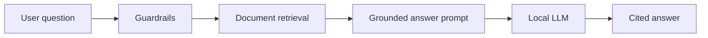
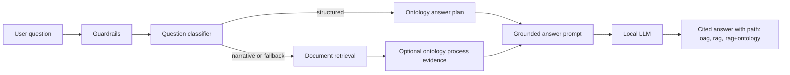

# 05 - RAG Framework and OAG Evolution

## Decision Summary

The assistant started as a governed RAG application: approved internal sources were ingested, retrieved and composed into cited answers. Sprint 6 introduced an ontology-assisted generation layer so structured process questions can use graph facts before or alongside document passages.

Decision Log entry, 2026-07-04: keep document RAG as the broad narrative baseline, add OAG-first routing for structured process facts, and measure the architecture rather than asserting it is better.

## Before

The original route worked well for explanatory questions, but structured questions such as owners, controls, systems and dependencies could be brittle because the model had to infer graph-like relationships from prose chunks.

## After

`oag_first` is now the production Ask routing mode:

- structured questions try ontology object/link evidence first;
- narrative questions keep document RAG as the main path;
- matching process facts can be appended as compact ontology evidence;
- answer traces and usage logs record `answer_path` so adoption can be measured.

## Benchmark Evidence

Benchmark: `tests/evaluation/rag_vs_oag_questions.json`

Harness: `scripts/evaluate_rag_vs_oag.py`

Current method and decision note: `docs/benchmark/oag/oag-benchmark-method-and-decision.md`

The first real three-run result on 2026-07-05 established that OAG-first was
worth pursuing:

| Config | Accuracy | Mean latency | P95 latency |
|---|---:|---:|---:|
| RAG-only | 64% | 3.26s | 5.94s |
| OAG-first | 70% | 2.56s | 4.72s |
| OAG-only | 18% | 0.14s | 1.08s |

The latest OAG-6 holdout scorecard on 2026-07-06 is the current decision
evidence for structured process questions:

`docs/benchmark/oag/rag-vs-oag-rag_only-oag_first-2026-07-06T19-47-56+00-00.md`

| Config | Passed | Accuracy | Path hit | Stability |
|---|---:|---:|---:|---:|
| RAG-only | 47/72 | 65% | 50% | 20/24 |
| OAG-first | 67/72 | 93% | 100% | 23/24 |

Interpretation:

- OAG-first is currently the best default route.
- Structured entity, structured relationship and aggregate/list holdout rows
  are now 100% under OAG-first.
- Out-of-scope refusal remains 100%.
- Remaining OAG-first misses are narrative/mixed wording rows, so document RAG
  remains the right baseline for broad explanatory questions.

## Known Limits

The benchmark also exposed useful boundaries:

- OAG-only is a boundary probe, not a target user mode;
- holdout rows must not be tuned directly after they have informed fixes;
- ontology quality depends on approved-source extraction and schema coverage;
- mixed/narrative questions remain composition work, not a reason to bypass RAG.

These limits are preserved as validation evidence rather than hidden.
