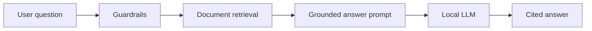
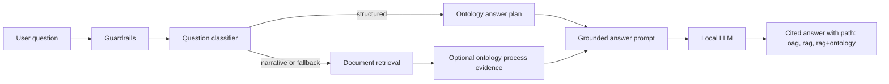

# 05 - RAG Framework and OAG Evolution

## Decision Summary

The assistant started as a governed RAG application: approved internal sources were ingested, retrieved and composed into cited answers. Sprint 6 introduced an ontology-assisted generation layer so structured process questions can use graph facts before or alongside document passages.

Decision Log entry, 2026-07-04: keep document RAG as the broad narrative baseline, add OAG-first routing for structured process facts, and measure the architecture rather than asserting it is better.

## Before

The original route worked well for explanatory questions, but structured questions such as owners, controls, systems and dependencies could be brittle because the model had to infer graph-like relationships from prose chunks.

## After

`oag_first` is now the production Ask routing mode:

- structured questions try ontology object/link evidence first;
- narrative questions keep document RAG as the main path;
- matching process facts can be appended as compact ontology evidence;
- answer traces and usage logs record `answer_path` so adoption can be measured.

## Benchmark Evidence

Benchmark: `tests/evaluation/rag_vs_oag_questions.json`

Harness: `scripts/evaluate_rag_vs_oag.py`

Corrected scorecard: `docs/benchmark/oag/rag-vs-oag-rag_only-oag_first-oag_only-2026-07-05T18-07-41+00-00.md`

First real three-run result:

| Config | Accuracy | Mean latency | P95 latency |
|---|---:|---:|---:|
| RAG-only | 64% | 3.26s | 5.94s |
| OAG-first | 70% | 2.56s | 4.72s |
| OAG-only | 18% | 0.14s | 1.08s |

Interpretation:

- OAG-first is currently the best default route.
- Structured relationship questions improved by 10 points.
- Aggregate/list questions improved by 33 points.
- Narrative answers did not degrade.
- Out-of-scope refusal remained at 100%.

## Known Limits

The benchmark also exposed useful follow-up work:

- mixed questions remain weak and need better graph-plus-document composition;
- structured entity ownership sometimes falls back to RAG + ontology instead of clean object evidence;
- OAG-only is a boundary probe, not a target user mode;
- the scorer had to be corrected to handle faithful paraphrase rather than exact phrase copies.

These limits are preserved as validation evidence rather than hidden.
