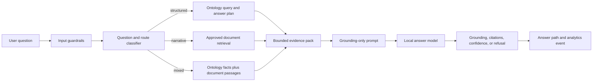

# Hybrid RAG and OAG framework

## Decision

OpsAtlas uses a governed hybrid answer architecture:

- document retrieval-augmented generation (RAG) remains the narrative and contextual baseline;
- ontology-assisted generation (OAG) is preferred for structured organisational objects and relationships;
- mixed questions can combine compact ontology facts with retrieved source passages;
- unsupported questions are refused rather than answered from unbounded model memory.

This design keeps approved source evidence authoritative while avoiding fragile prose inference for graph-like questions such as owners, systems, controls, dependencies, and counts.

## Evidence flow

```mermaid
flowchart LR
    Question["User question"] --> Guardrails["Input guardrails"]
    Guardrails --> Classifier["Question and route classifier"]
    Classifier -->|structured| OAG["Ontology query and answer plan"]
    Classifier -->|narrative| RAG["Approved document retrieval"]
    Classifier -->|mixed| Both["Ontology facts plus document passages"]
    OAG --> Evidence["Bounded evidence pack"]
    RAG --> Evidence
    Both --> Evidence
    Evidence --> Prompt["Grounding-only prompt"]
    Prompt --> LLM["Local answer model"]
    LLM --> Validate["Grounding, citations, confidence, or refusal"]
    Validate --> Trace["Answer path and analytics event"]
```

Only approved source content participates in document retrieval or ontology synchronisation. The route and final evidence path are recorded so performance and adoption can be inspected.

## Control boundaries

- The ontology is assistive, not a replacement for approved documents.
- OAG reads schema-governed SQLite objects and links through `OntologyQueryService`.
- The answer model receives selected evidence; it is not asked to invent organisational facts.
- Ontology actions are schema-validated, audited, and human approved.
- `oag_only` is an evaluation boundary used to reveal where ontology coverage is insufficient; it is not exposed as the general answer mode.

## Decision-grade benchmark

Dataset: `tests/evaluation/rag_vs_oag_questions.json`

Harness: `scripts/evaluate_rag_vs_oag.py`

Accepted raw result: `docs/benchmark/oag/rag-vs-oag-final-benchmark.json`

The benchmark used 69 labelled questions, 45 tuning questions, a 24-question untouched holdout, three configurations, and three repeated runs. This produced 621 executions in total.

### Holdout result

| Configuration | Passed | Accuracy | Route accuracy | Stable questions | Mean latency |
|---|---:|---:|---:|---:|---:|
| RAG-only | 53/72 | 73.61% | 50.00% | 22/24 | 3.84s |
| OAG-first | 68/72 | 94.44% | 100.00% | 23/24 | 1.32s |
| OAG-only | 48/72 | 66.67% | 83.33% | 24/24 | 0.03s |

OAG-first holdout accuracy by category was:

| Category | Accuracy |
|---|---:|
| Structured entity | 100% |
| Structured relationship | 100% |
| Aggregate | 100% |
| Narrative | 91.7% |
| Mixed | 75% |
| Out-of-scope refusal | 100% |

Overall, OAG-first reached 79.71% accuracy at 1.70s mean latency; RAG-only reached 71.98% at 4.12s. OAG-only reached 49.28% overall, demonstrating why structured ontology evidence must retain a document-RAG fallback.

## Interpretation and limitations

The accepted result supports OAG-first as the preferred hybrid route in the proof of concept. It does not establish universal production performance. The labelled corpus is small, local model and hardware characteristics affect latency, ontology quality depends on extraction and schema coverage, and mixed/narrative questions remain harder than purely structured questions.

The final method, category analysis, and limitations are recorded in [the benchmark README](../benchmark/oag/README.md).
