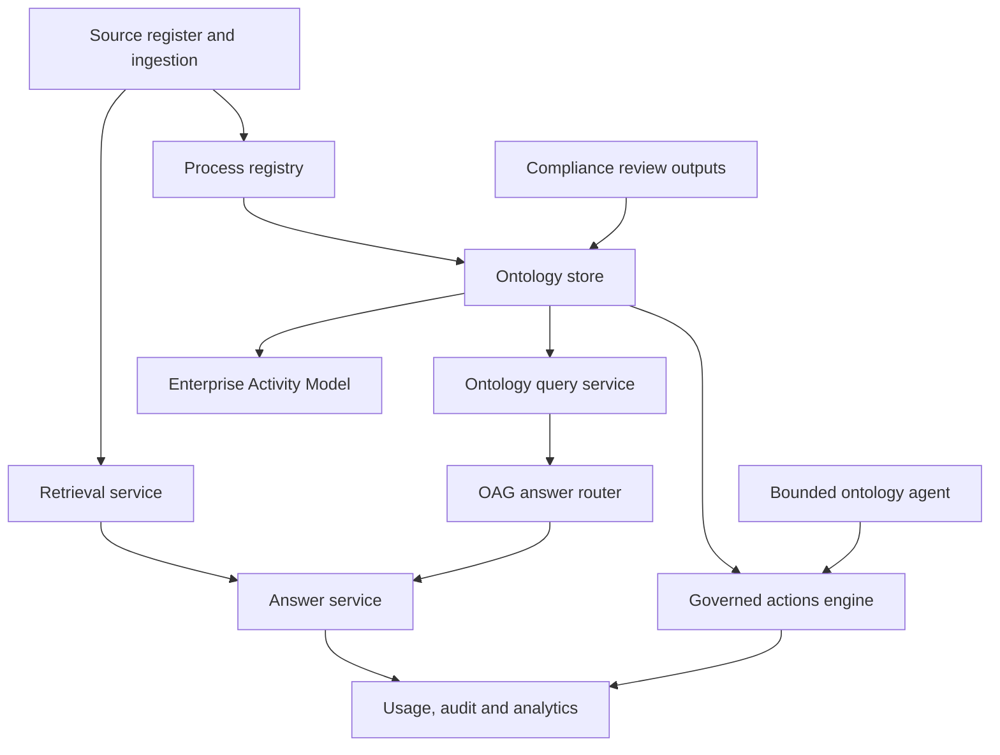

# 07 - Core Modules

## Current Core Modules

## Module Responsibilities

| Module | Responsibility | Evidence |
|---|---|---|
| Source register | Tracks uploaded and public-source documents, approval state and ingestion state. | `src/assistant/sources/register.py` |
| Section store | Stores parsed sections used by retrieval and governance checks. | `src/assistant/ingestion/store.py` |
| Retrieval service | Performs lexical/embedding retrieval over approved sections. | `src/assistant/retrieval/service.py` |
| Process registry | Extracts process facts from approved sources for inspection and diagramming. | `src/assistant/process/registry.py` |
| Ontology store | Persists governed objects and links in SQLite. | `src/assistant/ontology/store.py` |
| Ontology query service | Exposes schema, object search, object detail and graph traversal. | `src/assistant/ontology/query.py` |
| Enterprise Activity Model | Projects ontology processes into domain/lifecycle cells, entity registries, four SVG views and deterministic gap/overlap/clash signals. | `src/assistant/eam/*`, `docs/architecture/enterprise-activity-model.md` |
| OAG router | Builds structured answer plans and compact ontology fallback evidence. | `src/assistant/ontology/router.py` |
| Answer service | Orchestrates guardrails, OAG-first routing, RAG fallback, citations and telemetry. | `src/assistant/answer/service.py` |
| Actions engine | Validates and executes governed mutations with audit log entries. | `src/assistant/ontology/actions.py` |
| Ontology agent | Bounded read/propose loop for investigation and human-approved proposals. | `src/assistant/ontology/agent.py` |
| Analytics evidence | Exposes answer-path split, ontology stats and validation protocols. | `src/assistant/evidence/validation.py` |
| Compliance reasoning bridge | Connects Governance to the standalone pairwise reasoning service for long-running internal/external review jobs. | `src/assistant/compliance/*`, `services/compliance_reasoning/*` |

## OAG Control Points

OAG is deliberately bounded:

- schema and object/link definitions are explicit in `registry_schema.json`;
- graph reads are exposed through a read-only query service;
- actions are schema-validated and auditable;
- the ontology agent cannot mutate directly;
- proposal approval is human-in-loop;
- answer routing records `answer_path` for measurement;
- `VAL-OAG-001` benchmarks OAG-first against RAG-only and OAG-only.
- `VAL-EAM-001` validates deterministic EAM projection, scale, provenance and
  dynamic refresh over governed ontology evidence.

## Decision Log Note

Decision Log entry, 2026-07-04: treat ontology as an assistive architecture layer, not a replacement for approved document evidence. RAG remains the baseline for narrative context; OAG is used where graph facts are more reliable than prose inference.

The first real benchmark on 2026-07-05 supported that decision: OAG-first was
better than RAG-only on the measured structured categories, while the OAG-only
boundary probe performed poorly on narrative questions.

The OAG-6 holdout run on 2026-07-06 is the current structured-answer decision
evidence: OAG-first reached 67/72 (93%) versus RAG-only at 47/72 (65%), with
100% path hit and full marks on structured entity, structured relationship,
aggregate/list and out-of-scope rows. This validates OAG-first for structured
process facts while keeping document RAG as the narrative baseline.

Decision Log entry, 2026-07-06: retire the earlier Operating Model page in
favour of the Enterprise Activity Model. The EAM is the current operating
intelligence canvas because it is ontology-backed, multi-view, source-provenant
and scale-tested. Process Stress Lab remains parked as a diagnostic scenario
tool rather than final operating-model evidence.
