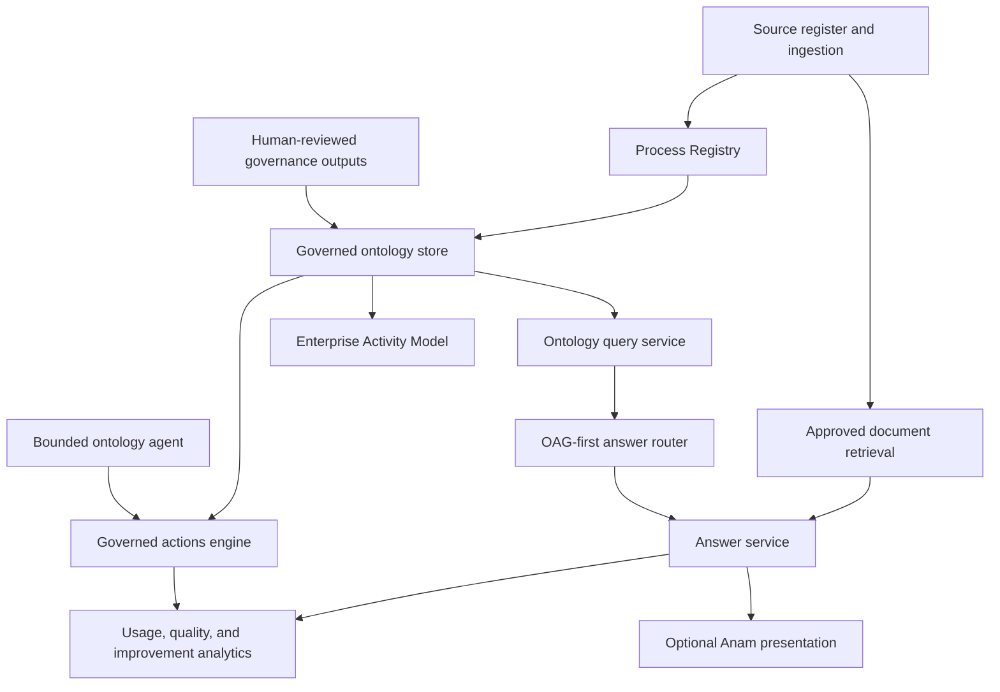

# Core modules

## System composition

```mermaid
flowchart TB
    Sources["Source register and ingestion"] --> Retrieval["Approved document retrieval"]
    Sources --> Process["Process Registry"]
    Process --> Ontology["Governed ontology store"]
    Compliance["Human-reviewed governance outputs"] --> Ontology
    Ontology --> Query["Ontology query service"]
    Ontology --> EAM["Enterprise Activity Model"]
    Query --> Router["OAG-first answer router"]
    Retrieval --> Answer["Answer service"]
    Router --> Answer
    Answer --> Analytics["Usage, quality, and improvement analytics"]
    Ontology --> Actions["Governed actions engine"]
    Agent["Bounded ontology agent"] --> Actions
    Actions --> Analytics
    Answer --> Avatar["Optional Anam presentation"]
```

## Responsibilities

| Module | Responsibility | Primary implementation |
|---|---|---|
| Source register | Tracks uploaded and public-source documents, metadata, approval, and ingestion state. | `src/assistant/sources/` |
| Section store | Stores parsed, source-provenant sections used by retrieval and governance review. | `src/assistant/ingestion/` |
| Retrieval service | Performs lexical and embedding retrieval, rewrite, thresholding, and reranking over approved sections. | `src/assistant/retrieval/` |
| Answer service | Orchestrates guardrails, OAG-first planning, RAG fallback/composition, citations, validation, refusal, and telemetry. | `src/assistant/answer/` |
| Process Registry | Builds structured process records, coverage, roles, systems, controls, and dependencies from approved sources. | `src/assistant/process/` |
| Ontology store | Persists schema-governed objects and links in local SQLite and reconciles duplicate entities. | `src/assistant/ontology/store.py`, `reconciliation.py`, `sync.py` |
| Ontology query and router | Searches objects, traverses relationships, creates structured answer plans, and supplies compact fallback evidence. | `src/assistant/ontology/query.py`, `router.py` |
| Enterprise Activity Model | Projects process ontology into five deterministic, source-provenant operating-intelligence views. | `src/assistant/eam/` |
| Governance intelligence | Runs Quick Scan, records decisions, manages remediation, and coordinates internal review jobs. | `src/assistant/governance/` |
| Compliance reasoning bridge | Connects Governance to the local cached pairwise screening/adjudication service. | `src/assistant/compliance/`, `services/compliance_reasoning/` |
| Actions engine | Validates proposed ontology actions against schema and records auditable human-approved mutations. | `src/assistant/ontology/actions.py`, `proposals.py` |
| Ontology agent | Performs a bounded read-and-propose investigation loop without direct mutation authority. | `src/assistant/ontology/agent.py` |
| Process diagram renderer | Validates diagram JSON and deterministically produces layouts, narration, animation steps, and SVG. | `services/process_diagram/` |
| Analytics | Aggregates demand, outcomes, evidence paths, grounding, recurrence, retrieval health, governance history, OAG operations, complexity, forecast, and improvement actions. | `src/assistant/analytics/` |
| Value model | Applies explicit, editable assumptions to local evidence without claiming realised value. | `src/assistant/value/` |
| Digital SME | Reuses the validated core answer and delegates only avatar/speech presentation to Anam. | `src/assistant/api/routes_avatar.py`, `frontend/src/AvatarLabPage.tsx` |

## Governance control points

- Source approval gates both retrieval and ontology synchronisation.
- Ontology object and link definitions are explicit in `src/assistant/ontology/registry_schema.json`.
- The query service is read-only; mutations pass through the actions engine.
- The ontology agent proposes but cannot directly mutate.
- Compliance findings require human disposition and cannot silently alter source knowledge.
- Process diagrams render process evidence but cannot modify process records.
- Answer paths are recorded for comparison and operational analytics.
- Analytics reports read existing events and stores; they do not become knowledge authority.
- Anam receives presentation text from the core answer route and does not independently answer the question.

## Architectural decision

Ontology is an assistive operating-intelligence layer, not a replacement for approved document evidence. The accepted decision-grade benchmark showed that OAG-first materially improved structured and relational answering on the measured holdout while RAG remained necessary for narrative and mixed questions. The retained architecture is therefore hybrid by design.

The Enterprise Activity Model applies the same principle visually: it deterministically projects governed ontology evidence and exposes gaps or dependencies without claiming that the live enterprise operating model is complete.
