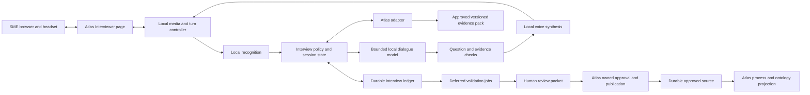

# Proposed interview service architecture

**Status: G0 direction accepted for the isolated synthetic E1 trial. Detailed contracts and later publication readiness remain subject to implementation evidence and G3/G4.** No endpoint, data model or service below is claimed to exist unless explicitly listed as an existing Atlas interface.

## Service boundaries

One deployable interview service owns sessions, audio orchestration, transcript revisions, question planning, a claim ledger, conflict cases and asynchronous jobs. ASR, TTS and the dialogue model are replaceable local workers/adapters with their own runtime dependencies. Start with one service and one durable local job queue; do not introduce a distributed event platform or Kubernetes for the PoC.

OpsAtlas retains its API, approved sources, ontology, Process Registry, EAM and existing answer behaviour. A narrow Atlas adapter supplies authorised evidence and submits review packets to an Atlas-owned publication boundary. The interviewer never opens Atlas's SQLite file or writes its source/section stores. An independent service can also use a fixture adapter and run without Atlas; its standalone mode clearly reports the absence of Atlas evidence and publication.



The UI connection is independently cancellable. Audio data does not traverse `/api/ask`. An Atlas frontend feature flag and unavailable-service state protect normal navigation. The existing Anam feature is unchanged and is never a fallback for this service.

## Three validation lanes

| Lane | Work | Bound and outcome |
|---|---|---|
| Live | Transcript stabilisation; names/numbers/negation; required slots; exact entity and scope checks; retrieval from session pack; bounded contradiction candidate | Target a 350 ms budget for evidence/check work after a stable segment. Budget expiry yields `unchecked` or `needs_review`, never “verified” |
| Short break | Compare newly captured claims with relevant approved candidates; deduplication, scope/date comparison, lightweight semantic adjudication | A proposed 2–5 minute opportunity, not an SLA. Show completed/remaining work and offer follow-up if unfinished |
| Background | Wider source review, external applicability, difficult conflict adjudication and owner input | Durable jobs with explicit progress, caps, retries and human disposition; may take hours |

Live checks prioritise high-impact ambiguity and only raise a possible discrepancy when there is a stable transcript, a specific cited comparator, and overlapping subject/scope/effective period. They do not decide that either source is true. A missing retrieval hit is not evidence that the knowledge does not exist.

Model validation is itself fallible. Do not lower acceptance thresholds to hide a slow check. Reduce the candidate set, defer a question, or finish with open issues. Pre-warm the live models; deprioritise heavy review jobs during audio sessions and observe Atlas latency under load.

## Turn and audio control

States include `idle`, `listening`, `possible_end`, `planning`, `speaking`, `interrupted`, `paused` and `finished`. Audio capture continues during playback only with echo cancellation and appropriate capture permission. The controller distinguishes real user speech from playback echo; it cancels queued and active synthesis on a confirmed interruption. Tag work with session, turn, transcript revision and generation IDs so late results cannot speak or mutate the current turn.

Treat provisional ASR text as provisional. Stabilised segments can seed questions; only final or explicitly confirmed text can support a claim presented for approval. A transcript correction invalidates its derived candidates and review results, then schedules recomputation. Keep an event identifying the correction rather than silently rewriting history.

Backchannels such as “mm-hm” should be optional, sparse and interpreted as attention, not agreement. Start with short checked utterances rather than sending unvalidated model tokens straight to TTS. Maintain an allowlist of non-factual acknowledgements and exact approved question text. TTS may alter prosody, not content. Streaming shorter clauses is allowed only after the clause passes its relevant check.

## Session data model

| Record | Minimum fields and meaning |
|---|---|
| InterviewSession | ID, mode, topic/process, language, participants/roles, policy version, recording choice, scope, evidence snapshot, start/end, status |
| TranscriptSegment | Segment/turn IDs, revision, audio time span, provisional/final state, verbatim text, quality flags, correction lineage |
| CandidateClaim | ID, source segment/revision, original wording, structured proposition, subject/entity references, policy/practice/proposal kind, modality, conditions, region/process/version scope, valid dates or explicit unknowns |
| EvidenceReference | Source ID/version/hash/section, excerpt boundaries, approval eligibility, snapshot time, retrieval method; never a bare model assertion |
| ValidationResult | Claim revision, check/version/model, compared evidence, status, rationale, scope applicability, uncertainty, coverage and time |
| ConflictCase | Related claim IDs, evidence on each side, ambiguity/contradiction/duplicate/variant classification, owner, disposition and rationale |
| ApprovalRecord | Exact packet/hash/revision, authenticated actor and role (or PoC operator label), authority scope, time, decision, rationale and supersession links |
| PublicationReceipt | Idempotency key, input hash, Atlas source ID/version/hash, projection status, audit IDs and recoverable error state |
| FollowUp | Bounded question, relevant references, intended owner/role, requested response, status, due date if agreed; delivery is separate from creation |

Do not merge ASR quality, evidence strength, model confidence and human approval into one “truth score.” Their meanings differ. Keep interview certainty separate from whether a referenced policy is approved and applicable.

### Claim lifecycle

`captured → SME-confirmed → validation-pending → ready-for-owner-review → owner-approved → publication-pending → published`.

Alternative states include `needs-clarification`, `disputed`, `rejected`, `withdrawn`, `superseded` and `publication-failed`. Every material edit changes the revision and invalidates approvals for the previous content. An SME may correct an account; only an authorised owner approves publication. “Published” requires an Atlas receipt and projection verification, not merely an HTTP request being sent.

### Illustrative synthetic assertion

```json
{
  "claim_id": "claim-example-01",
  "revision": 2,
  "kind": "reported_practice",
  "subject": "supplier activation",
  "predicate": "requires approval by",
  "value": "regional operations owner",
  "conditions": ["emergency exception", "standard approver unavailable"],
  "scope": {"process_variant": "emergency", "region": "unspecified"},
  "valid_from": null,
  "source_segment": {"id": "segment-example-17", "revision": 2},
  "evidence_status": "needs_clarification",
  "approval_status": "not_requested"
}
```

This may coexist with a standard-process finance approval rule. Before labelling it contradictory, ask whether scope overlaps, whether this is reported practice rather than policy, who authorised the exception and when it applies. If scope remains unknown, preserve the uncertainty.

## Existing Atlas interfaces and proposed contracts

Existing reads include `/api/query`, `/api/ontology/schema`, `/api/ontology/objects`, `/api/ontology/objects/{id}`, `/api/ontology/traverse`, `/api/sources`, and the source-document read route under `/api/governance`. They have different semantics and do not together constitute a snapshot or authority service.

The proposed integration should expose a versioned evidence-pack contract and a staged interview-packet contract. Names below are design placeholders:

| Proposed interface | Contract |
|---|---|
| `POST /interviewer/v1/sessions` | Create session from explicit scope and pinned evidence pack; no implicit audio capture |
| `POST /interviewer/v1/sessions/{id}/connect` | Exchange a short-lived scoped connection credential; no Atlas operator token in query strings |
| `GET /interviewer/v1/sessions/{id}/events` | Ordered resumable event feed; authenticate and limit to the session |
| `POST /interviewer/v1/sessions/{id}/corrections` | Apply transcript revision with expected revision; stale edits return conflict |
| `POST /interviewer/v1/sessions/{id}/review-packets` | Produce immutable packet and content hash; enqueue declared validations |
| Atlas evidence-pack read | Approved facts/passages, sources and hashes, schema/pack version, scope and eligibility; no unrestricted filesystem input |
| Atlas staged-packet submission | Create pending submission with provenance, idempotency key and expected source versions; does not approve |
| Atlas review/publication command | Revalidate owner authority, packet hash, current versions and required dispositions; write durable source and receipt |

The first PoC can export a reviewed Markdown process draft and JSON manifest for manual source registration in a disposable Atlas copy. This proves parser compatibility without pretending the automated publication API already exists.

## Publication and rebuild safety

1. Freeze a claim-level review packet. Identify approved claims, unresolved claims and excluded transcript material separately.
2. Record the approving actor's actual authority and the exact packet hash. Do not let spoken instructions call an approval tool.
3. Recheck referenced source hashes/approval state and policy versions. A material change returns the packet for review; no last-write-wins overwrite.
4. Generate a deterministic process-source artifact from approved claims, with a durable approval/provenance manifest. Exclude unresolved statements from the source text ingested for answering.
5. Register/ingest the source as pending via Atlas-owned operations. Approve through the authorised Atlas workflow only after its checks pass.
6. Rebuild projections and verify the published statements, citations, Process Registry and EAM behave as expected. Persist a receipt; retries with the same key/content return the same logical publication.
7. If registration succeeds but projection fails, retain `publication-pending`/failure and retry safely. Do not report full success or create duplicate sources. Reject reuse of an idempotency key with different content.

A PoC may use a durable SQLite job table in the interview service and a small publication journal at the Atlas boundary. At-least-once retries with idempotency are sufficient; no unsupported exactly-once promise. Recovery tests cover crashes before/after registration and after approval but before receipt acknowledgement. Cross-store operations need a recoverable state machine, not a fictional distributed transaction.

Supersession retains prior source versions and a reason. Revocation makes affected evidence unavailable to future packs and invalidates pending approval decisions. Backups and deletion rules must distinguish retained governance provenance from removable audio or identity. No direct graph-only claims are permitted.

## Security and failure behaviour

Bind PoC services to loopback, restrict browser origins, and grant only the minimum service routes. The existing Atlas operator credential is not a suitable general participant credential. LAN/multi-user use requires transport protection, scoped identities and permissions first. Treat transcripts and retrieved documents as untrusted data; tool execution uses deterministic allowlisted commands, never arbitrary prompts, paths or SQL.

Raw audio is transient by default; durable transcript/claim storage is explicit and reviewable. Put interview state in a separate data directory with its own backup/retention policy and redacted operational logs. Do not store PATs, model prompts containing participant content or recordings in Git/ADO. Versioned model and prompt identifiers can be logged without full content.

| Failure | User-visible result and control |
|---|---|
| Atlas unavailable | Continue only if a permitted pinned pack is available, labelled with its time; otherwise capture without verification. Never publish offline |
| Model/check timeout | Explain that the point needs review; retain pending status |
| Audio/ASR uncertainty | Ask for repetition or text correction; pause semantic challenge |
| TTS failure | Show checked text and allow typed continuation |
| Worker overload | Reduce optional live checks, pause background jobs or offer a later follow-up; preserve approval criteria |
| Disconnect | Persist acknowledged transcript events and resumable state; show any audio gap explicitly |
| Source changes mid-session | Mark evidence stale and revalidate before owner review/publication |
| No accountable reviewer | Keep the case open and ask for an owner; do not invent authority |

## Future extension boundary

Meeting companions need speaker identity/diarisation, overlapping audio, permission changes when participants join, uncertainty over attribution, host controls and a request-to-speak queue. Desk devices need acoustic echo tests and an actual hardware mute. These reuse the session/claim contracts but cannot inherit the single-SME PoC's acceptance result.
