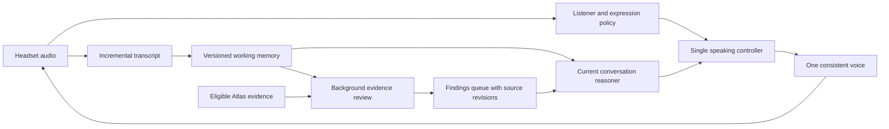

# Expressive local conversation: research and proposed architecture

20 September 2026. Research and design recommendation, not a model selection or deployment. Implementation/promotion is paused while the conversation experience is reconsidered. Local inference on the M4 Max Mac Studio, 64 GB unified memory, remains the constraint. No new models were installed or benchmarked for this report.

## Recommendation

Build an experience lab comparing two architectures: a modular listener with expressive TTS, and a speech-native full-duplex model. Preserve the transcript ledger, corrections and grounding as separate responsibilities. Do not commit to Kokoro, the current 35B planner, or a database replacement before this comparison.

The proposed three speeds are appropriate, with two additions: a single controller owns the speaking turn, and all reasoning uses versioned working memory. An expression layer still needs light context; it cannot decide whether “wow” or “take your time” is appropriate from a silence timer alone. Literal zero latency is not achievable; cached audio can remove synthesis from selected listener reactions, but observation, decision and playback still take time.

The user's pronunciation and pacing feedback takes precedence over the earlier speech-to-ASR check. Recognisable output does not establish correct pronunciation, pleasant phrasing or natural prosody. Inspect pronunciation/phonemization, voice identity, synthesis and clause boundaries separately. The existing renderer expands sterling amounts but has no dedicated pronunciation lexicon for “Finance”, “recap”, names or acronyms. The current voice catalog contains two female Kokoro voices and a designed Qwen voice; it is not a broad audition.

## What research supports

| Candidate | Relevant evidence | Implication for this Mac and project |
|---|---|---|
| **Pocket TTS** | Kyutai documents a 100M CPU model, streaming output, approximately 200 ms first audio, and about six times real-time generation on an M4 MacBook Air using two CPU cores. | First practical replacement to audition; CPU speech could reduce GPU contention. Published results are not our Mac benchmark, nor evidence of a suitable British accent. [Maintainer documentation](https://kyutai-labs.github.io/pocket-tts/) |
| **Chatterbox Turbo / Flash** | Turbo supports vocal-reaction tags. Flash is a separate streaming generation approach and exposes an experimental Apple Silicon MLX backend. | Audition Turbo for expression and Flash for streaming viability. Do not assume Turbo's reaction support transfers unchanged to Flash, or transfer vendor GPU latency numbers to Metal. [Turbo](https://github.com/resemble-ai/chatterbox), [Flash](https://github.com/resemble-ai/chatterbox-flash) |
| **Qwen3-TTS** | The family offers voice design and instruction-controlled delivery. Its public Python VoiceDesign method documents simulated streaming-input behaviour rather than true streaming generation in that method. | Retain as a quality contender, using one approved, stable voice reference rather than redesigning a voice every utterance. The earlier American-sounding C sample rejects that sample, not every configuration. Verify actual chunk delivery in the chosen runtime. [Model family](https://github.com/QwenLM/Qwen3-TTS), [inference code](https://github.com/QwenLM/Qwen3-TTS/blob/main/qwen_tts/inference/qwen3_tts_model.py) |
| **VibeVoice Realtime** | Microsoft describes a 0.5B streaming-text TTS model with approximately 300 ms first audible latency. | Reserve candidate if the first audition leaves a quality gap; no claim of that speed on this Mac. [Official repository](https://github.com/microsoft/VibeVoice) |
| **PersonaPlex** | NVIDIA's speech-native model supports simultaneous listening/speaking, backchannels, voice conditioning and role prompting. | Strong experience benchmark. Its generated words and delivery are coupled; treating it as a perfectly controllable reader of externally checked text would be an unproven assumption. [Research and demos](https://research.nvidia.com/labs/adlr/personaplex/), [code and model licensing](https://github.com/NVIDIA/personaplex) |
| **MoshiRAG** | Combines a duplex speech frontend with asynchronous external knowledge. The release requires substantial GPU resources and warns of sensitivity to retrieval delays beyond three seconds. | Closest research precedent for the proposed separation. Its short retrieval window is not our arbitrary-duration deep-review queue. Treat it as an architectural reference, not a drop-in Mac package. [Paper](https://arxiv.org/abs/2604.12928), [implementation](https://github.com/kyutai-labs/moshi-rag) |

The community Swift/MLX PersonaPlex implementation documents about 9 GB total for its preferred 8-bit variant and an M2 Max example taking 112 ms per 80 ms audio step: RTF 1.4, slower than real time. It reports degraded output with its 4-bit variant. This is implementation-author evidence, not NVIDIA certification or an M4 Max result. Memory fit alone does not establish continuous real-time execution under Atlas load. [Port documentation](https://github.com/soniqo/speech-swift/blob/main/docs/models/personaplex.md)

Implementation follow-up: [document 24](24-experience-lab.md) records actual Mac
measurements, input-clock and voice-cache fixes, and failed conversational-control
checks. The community 8-bit model card declares CC BY-NC 4.0; it is not a deployment
artifact. Native speech remains an experimental comparator, not a selected engine.

Unmute is another useful modular reference: it connects a text LLM to streaming recognition/synthesis. Its documented deployment is GPU-oriented, including Linux/WSL and CUDA paths; it is not evidence of turnkey Mac performance. [Official implementation](https://github.com/kyutai-labs/unmute)

## Proposed architecture

The diagram describes our proposed modular design. The duplex experiment may merge listener and voice generation; preserving the controller and source boundaries then requires additional integration work.

### 1. Listener and expression

Continuously estimate whether the person is continuing, yielding, searching for words, correcting themselves, giving a backchannel or interrupting. Combine audio cues, recent words and conversation state. Do not infer an emotional diagnosis from a pause. Silence is a valid action.

Smart Turn is a practical endpoint candidate: its audio model considers cues beyond basic VAD, with maintainer-reported CPU inference as low as 10 ms. It determines completion, not the full repertoire of listener behaviour. Voice Activity Projection research addresses future turn shifts and backchannel opportunities; its stereo model requires separate speaker channels, which we can derive from microphone and known playback. [Smart Turn](https://github.com/pipecat-ai/smart-turn), [VAP research](https://arxiv.org/abs/2205.09812), [VAP implementation](https://github.com/ErikEkstedt/VoiceActivityProjection)

Start with a small, testable action policy: wait, acknowledge, encourage, yield, request hearing clarification. Use same-voice, context-appropriate recorded/generated reaction variants with cooldowns and repetition limits. Micro-reactions can be cached; longer remarks should use the chosen expressive voice. “Mm-hm” indicates attention, not agreement. “Interesting”, “wow”, praise and laughter need semantic appropriateness; they should not be automatic punctuation after every answer. A long pause may deserve uninterrupted thinking time before one gentle “Take your time”.

Proposed engineering budget: policy decision within 50 ms once sufficient evidence is available; selected short reaction audible within roughly 100–250 ms after the policy chooses it. Those are targets, not measurements, and not instructions to speak that quickly after every pause. Do not insert reactions to conceal a slow question.

### 2. Current conversation

A resident local reasoner receives a bounded current-state packet: recent transcript, current question, established events, explicit unknowns, negations, corrections, unanswered details, applicable principles, and eligible queued findings. It updates this state incrementally while listening. Prepare tentative follow-ups early; revalidate against the final transcript revision before speaking.

Separate “who approved”, “whether approval occurred”, “whether activation occurred”, and their order. Store intended/requested actions separately from completed events. Keep uncertainty explicit. A contradiction is initially a possible discrepancy to clarify; do not equate a corrected answer or a different regional rule with inconsistency.

Budget remains p50 ≤1.5 seconds from detected speech end to the first substantive response, with p95 reported separately. A cached “mm-hm” cannot satisfy this metric. Compare local planner candidates on the same independent tasks; the existing 35B model is a baseline, not an architecture commitment. Our previous 4B routing failure means a smaller model must earn its place through measured correctness, not parameter count.

### 3. Background research

Launch event-driven jobs on material state changes, not an unbounded constant polling loop. Retrieve eligible Atlas evidence, compare dates/scope/versions, find duplicate accounts and candidate discrepancies, then enqueue a proposed clarification with verbatim evidence, source IDs and session revision. Deduplicate findings and invalidate them when an answer or evidence revision changes.

The live reasoner selects an appropriate later moment. Background jobs never speak directly. Their output must still be checked against the latest account: a discrepancy may already have been resolved while research ran.

At wrap-up, take an explicit transcript revision as the review boundary. Offer a brief “coffee break” only if work is pending; show actual progress, a bounded wait and an option to finish with unresolved items recorded. A timeout means review incomplete, not “nothing found”. Completed review means no further issues found within the stated checks and sources, not universal factual approval.

### Single speaking controller

Own the audio queue and microphone turn. Prioritise user interruption; cancel unsent obsolete output. If a short encouragement has begun, let it finish before the substantive question unless the user interrupts. Do not have different layers race to the speaker. Distinguish the user's quiet acknowledgement from an attempt to take the floor. Reserve runtime capacity for this controller, audio and live reasoning; admit deep jobs at low priority and suspend new ones when latency or memory pressure rises. An asynchronous task can still contend for the same GPU.

## Memory

Use three representations with different jobs:

1. **Hot session state in RAM:** a versioned map/graph of actors, events, ordering, uncertainty, source spans, corrections, question intent and pending findings. Small local reads are the immediate path. Persist events in the existing ledger so memory can be reconstructed after restart.
2. **Preloaded session evidence:** a bounded pack of applicable principles and eligible source excerpts, with dates and scope. Inference/prompt caches may accelerate use of this pack, but are not authoritative memory.
3. **Searchable archive:** hybrid exact/lexical and vector retrieval for the wider corpus, reached through background workers. SQLite FTS5 supports full-text retrieval; FAISS is one possible local vector-search library. Existing Atlas retrieval should be assessed before adding infrastructure. [SQLite FTS5](https://sqlite.org/fts5.html), [FAISS](https://github.com/facebookresearch/faiss)

A vector search retrieves related wording; it does not itself determine that “approved” and “not approved” conflict, or that both refer to the same incident. Preserve actor, scope, time and negation explicitly. “Highly available” here should initially mean resident, reconstructable and responsive on this single Mac; a replicated database would not make the Mac itself fault tolerant. No new neural/vector database is justified solely by the current 2.38-second gap.

## Next delivery: an experience lab

Pause feature expansion and main-service promotion. Keep the working prototype as a comparison baseline. The next deliverable should let us compare complete interactions, not just isolated voice samples:

1. Blind voice audition: British male and female candidates across Pocket TTS, Chatterbox and Qwen, with Kokoro as control. Use stock or appropriately licensed reference voices. Include Finance/finance, recap, abbreviations, £15,000 versus £50,000, negation, questions, long recap, uncertainty and corrections. Test both isolated words and sentence contexts. Do not assume gender changes pronunciation quality.
2. Compare listener timing with the same voice: baseline endpointing versus semantic endpointing, then carefully gated backchannels. Include slow recall, mid-sentence pauses, explicit “give me a moment”, overlapping acknowledgements, genuine interruptions and unrelated answers. Record whether reactions help, distract or pressure the participant.
3. Run a duplex feasibility spike: PersonaPlex/Moshi-style experience, local Mac speed and voice control, reliable interruption, and whether externally grounded content can be integrated without losing its provenance. Stop early if real-time factor or controllability fails. MoshiRAG remains the reference for asynchronous conditioning, not an assumed interchangeable component.
4. Compare the best two complete configurations in longer unscripted sessions, with model identity hidden during scoring. Measure naturalness, patience, pronunciation, appropriate acknowledgements, repeated questions, false contradictions and invented premises; record all failures. Keep development scenarios separate from the existing untouched holdout.

Rehearse internally before asking the user for one consolidated audition. Retain G1.5: ten unscripted minutes, no per-turn buttons or confirmation, median naturalness and pace ≥4/5, p50 substantive turn gap ≤1.5 seconds, zero fabricated spoken facts. Additionally measure cue timing, interruption cut-off, unnecessary interruptions and GPU/memory contention. Do not begin fine-tuning weights until we have evidence that voice selection, reference conditioning, pronunciation and interaction policy are insufficient.
